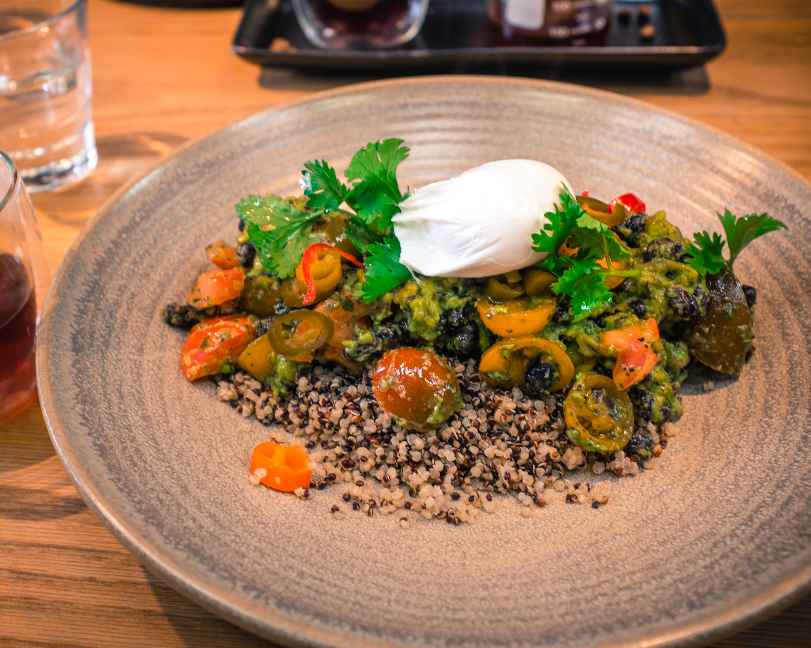
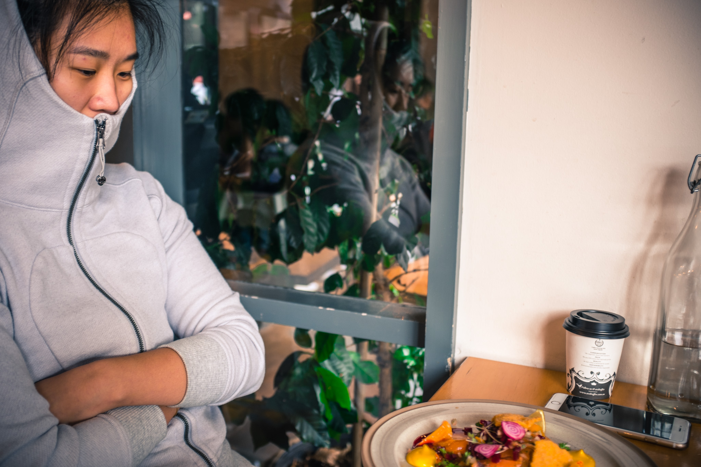

I'd like to preface this with a thanks to the series of circumstances that have given me the opportunity to make friends around the world.
It's a comfort to be welcomed with open arms when I decide to travel alone. That being said, I finally jumped the hurdle to go down under and pay Melbourne a visit.
My primary motivation is to attend the [Respond Melbourne 2016](http://www.webdirections.org/respond16/#speakers) conference on April 11-12th. However, I figured it would be a more memorable experience to take a few more days in the city to have time to experience its culture. I really want to validate claims that Melbourne and San Francisco are basically twins.

I also couldn't think of a better way to cash-in a long over-due :cake:-day #treatyoself vacation.

When it comes to the gastronomic culture in Melbourne, I think I'm in good hands.

_Mia photographing me photographing coffee_

I have to say, Melbourne has definitely tickled my hipster senses.

_Dedicated coffee menu at Industry Beans_

I've traveled to three different countries with Mia (India, United Arab Emirates, and now, Australia), and can trust her guidance when it comes to food and coffee.
I don't need to be persuaded when it comes to her opinionated views of what's good in her home turf.

My weekend arrival has been opportune to brunch food outings. I love me a good poached or baked eggs and have been extremely happy with the dishes I've had so far.

My first meal in Melbourne after a jet-lag fighting shower was at Industry Beans in Fitzroy. Fitzroy, as Mia describes it, is a _different_ kind of hipster neighborhood. Same prices, but less "posh" than some of the other ones.

_Poached egg on a bed of quinoa and crunchy black beans_

The plate I had at [Industry Beans](http://industrybeans.com/pages/seasonal-menu) was called Crispy Beans and Quinoa with a poached egg and avocado smash. 
I took my time to pick out each of the individual components with every bite I took. There was plenty of cilantro and jalapeno slices to give the plate a familiar Mexican kick but what really made me happy was the texture of the black beans that were hidden in the quinoa.
The texture and crunch from each bean was similar to one might experience with peanuts in a Thai dish. Black beans are my favorite beans and crunchy things are even better.
I suspected the poached egg (which was perfect) and avocado smash to make the plate, but the black beans were what I kept thinking about long after the last bite was gone. I could see myself making this for weekly lunch prep meals if I can pull it off.

During our Sunday post-workout foodie hunt, we ended up at [Axil Coffee](http://axilcoffee.com.au/) in Hawthorn for brunch.

_Post-workout hanger_

I've been exclusively eating sous-vide poached eggs after buying an Anova immersion circulator and had forgotten how great baked eggs can be.

_Spicy baked eggs with a dukkah spice blend and toast_

The [dukkah spice](http://www.thekitchn.com/egyptian-spice-mix-dukkah-91659) blend on top of the dish was what attracted me to the item on the menu after our [spice night at the office](/spice-night/).
I wanted appreciate and experience complexity of the blend on a egg dish. I also really like to bite into whole cumin seeds. :P

The spicy baked eggs had a lot going on. My mental notes would describe tasting salty bursts of feta, spicy and saucy base, crunchy and nutty, gelatinous egg yolks surrounded by firm egg whites.
The pumkin and seed toast helped me in mopping the pan clean of tomato and yolks as I punctured each egg. I also noted how ORANGE the yolks were at Axil.
I don't think I've ever eaten eggs with yolks that were that deeply colored in any other country before. :egg:

I really like eggs and the dishes in Melbourne have really hit the spot.

_Post-brunch archery adventure_

I got egg cravings while I was writing this post and simultaneously wandering around St. Kilda.

_When developers go to the beach._

Thankfully Mia recommended another top choice in the area, [Fitzrovia](http://fitzrovia.com.au/breakfast/), where I could enjoy a flat white and solo-dine al fresco and get a shot of yolk porn.

_A Persian take on baked eggs (green harissa, Persian fetta, and dukkah) with a side of spiced Merguez sausage. Solo-dining outside with Tame Impala jamming in the background._

_Those yolks are a game changer. :thumbsup:_
