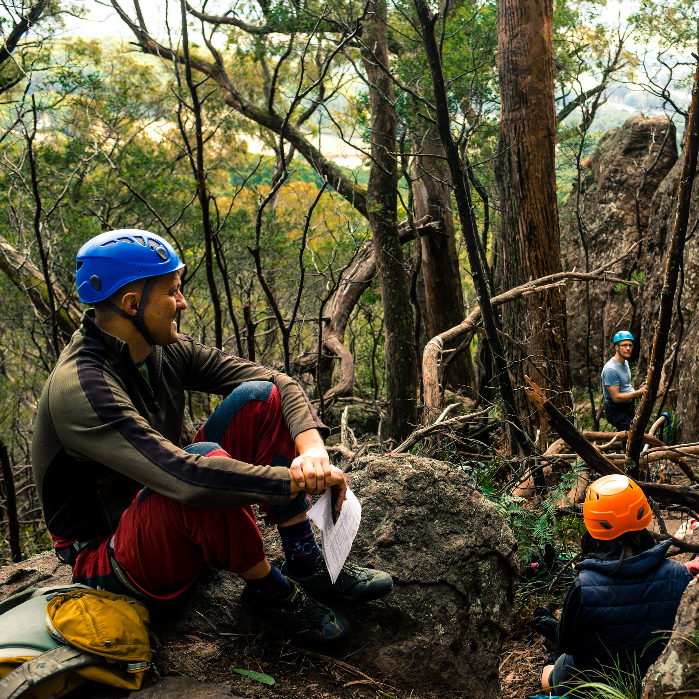

A recent post on about [solo travel Blue Bottle's blog](https://bluebottlecoffee.com/frequency/blue-bottle-culinary-solo-travel) shares some similarities in what I feel when traveling alone.
The post helped me realize that when it comes down to it, I have a good sense of my "core impulses", and was happy to have satisfied them while I was on vacation in Melbourne at the beginning of this month.
I didn't do much planning around the 13 day trip and although a lot of my adventures involve looking for an opportunity to photograph something special, not every moment has to be
picture-perfect.

My trip to Melbourne was what felt like a stay-cation in that I generally stayed in the city and did the things I normally do when I'm at home.
This involved morning lifting sessions, rock climbing indoor and outdoor, exploring coffee shops, markets, grocery stores and other shops.
Eating out a lot was out of my normal routine, but hey, vacation!

I didn't make a huge effort to check out some of the local Melbourne attractions, but the [collaborative exhibit between
Warhol and Weiwei at the National Gallery of Victoria](http://www.ngv.vic.gov.au/exhibition/andy-warhol-ai-wei-wei/) was something I wouldn't pass up.

## Climbing in Oz

One of the highlights of my trip was a day trip to [Mount Macedon](https://www.thecrag.com/climbing/australia/camels-hump/eastern-outcrops/area/626237892) with the [Victoria Climbing Club](http://vicclimb.org.au/events/beginners-fest-back-wall-camels-hump/). I was lucky in that my visit coincided
with one of their climbing trips to a crag nearby.

I am very thankful for the leaders of the trip, Ollie and Jayden, for letting me join, bringing an extra helmet for me, setting up routes, encouraging us to try harder routes, photographing our efforts, and rallying us around pre and post climbing coffees and snacks at the local [Trading Post](https://www.facebook.com/Mt-Macedon-Trading-Post-115565368525346/).
@[instagram](BECVNxKpZOS)

This trip was an opportunity to "get out of the city into nature" as I normally would at home on the weekends. I was also in joy to be around other amazing women. Beta is just not the same when a guy is giving it :P.

_Tying in for the first climb_

I've been asked why I like climbing by friends that don't climb. There's definitely an enjoyment in being in the context of hardship with the challenge of getting up the wall.
The intensity is just enough to shut other thoughts and troubles out of my mind. As much as I like the stretching I get from yoga, it does nothing to slow my mind down.
I also really like the opportunity to get to know others along the way when it comes to driving and hiking to the crag, tying in, and breaks between climbs.

_Lots of routes to choose from at the Back Wall of Camel's Hump_

The backgrounds of the group of climbers on this trip was very different from what I'm used to back home.
For once, I was the only one in tech and was surrounded by a pilot, doctor, and an environmentalist with a common goal: to get outside and grease the climbing groove.

_Crag full of climbers_

The Back Wall at Camel's Hump was very forgiving. The rating scale in Australia is linear from 7-39 where as in the US it starts from "5.1" to "5.15a". A [conversion chart](http://www.rockclimbing.com/Articles/Introduction_to_Climbing/Difficulty_Grades_and_Conversions_529.html) at
[Hardrock Climbing](https://foursquare.com/v/hardrock-indoor-rock-climbing/4b058755f964a520f88c22e3) showed I should be able to do a 21 on Australian standards
but I struggled to do anything over 18 on their walls.

What a pleasant surprise I had when the first route, a 14, I jumped on at the crag felt like a breeze. I later went on to do a couple of 15s and eventually a 16 without a problem. :raised_hands:

_Cheesin' at the top_

I was terrified to go climbing with strangers as we hiked to the base of the rock and even more to get there and not be able to climb a thing, but as we drove back to Melbourne, I felt a wave of happiness to have met some
friendly climbers on the other side of the world.

_Breaks between climbs_

_Thanks to Ollie for the photos of me!_
