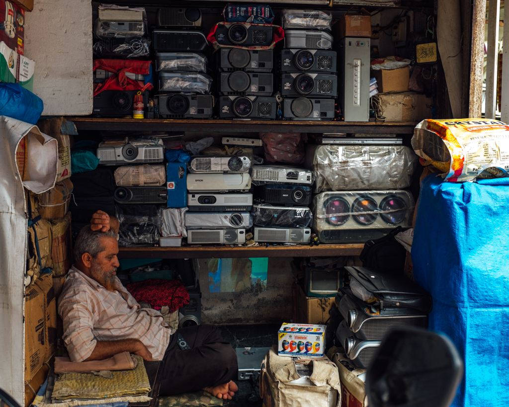

I'm beginning to get more comfortable in traveling alone during my time in India. For the most part, I plan out how to get to and from the destination and let everything else fall into place.
With the help of Uber, some practice in rickshaw haggling, and advice from friends, I've had the courage to trust myself to explore a lot of Pune and ride a train to get to Mumbia.

With each adventure, I later reflect on how potentially stupid these solo adventures could be after I'm home safe.
For example, taking a 9pm return train from Mumbai, arriving well after midnight and hopping into a rickshaw at 1am to get home? Stupid idea.
But I made it home safely and managed to negotiate with the autowallah to let me pay the "local rate" at that time of night.

To add on top of that, most of the day was spent in me walking around some of Mumbai's residential areas to find street art. Each venture into off-beaten paths was met
by locals staring at me with every step and snap I took, wondering what I was up to.

This past weekend was another stretch in putting my trust in the universe. This time I wasn't alone, but we put off purchasing train tickets for a day trip we had been planning the whole week. 
We were met with wait-lists on any of the departure times we considered.

So, our only options were to: forget the day trip or put our lives in the hands of random strangers to get to and from Mumbai.
There was no way we were going to let down an opportunity to go explore!

We discovered a service in India called BlaBlaCar and it allows drivers to offer up free seats in their cars for passengers looking to go in the same direction.
The unpredictability of when we'd be getting there and back was not something I really liked, but if someone else was going to take the risk with me
and the price was cheaper than hiring a private cab, why not?

The asking price per person to get to Mumbai was reasonable, just a little over the equivalent of $6 USD to travel 150 km (or around 94 mi).
After a few back-and-forth messaging via the app, all we had to do was stand outside a Hyundai dealership at 6:45am with cash to get picked up along the route to Mumbai. No big deal.

The good news is that we got dropped off in a reasonable location in North Mumbai where we could hop on a local train to get to Colaba and Fort.
Taking the local train is something I became fond of for the people watching. The blend of men (I could count the number of woman on one hand) we encountered was unique
in that some were dressed for business, others in more traditional wear, and a few like hip Mumbaikars.

The rest of the day was spent poking in and out of antique shops in Chor Baazar and hunting down galleries that required us to ring a bell to gain entrance each time we found one. 

At the end of the day, we sat in a restaurant thinking how the hell we were going to get back. Go to the closest bus stand and hope someone understood us and had a couple of open spots back to Pune? Or take our chances with BlaBla again?

BlaBla pulled through, and this time our friend came all the way to Kala Ghoda Cafe to pick us up after we decided on post-dinner affogatos to kill some time. The drive back was a little wild,
our friend was not shy in weaving in and out of traffic as we hopped on to the Mumbai-Pune expressway. We made small talk about his startup, travel, and what we did for work. This guy even knew
who ThoughtWorks was and had an opinion about it.

As we neared Pune, our driver felt it would be best if he just drop us off at our apartment instead of the original plan to drop us off at an intersection. As we neared the gate, he told us
there was no need to pay.
I was in disbelief. "Why?", "Because I made you wait for me and I like meeting new people."

As I handed our friend some money to at least cover part of the trip, we heard dogs barking, a car slamming on brakes, a thud, a whimper,
and then more barking as the car continued down the street.

The dog got back up and continued running after the car still barking, but with a whimpering tone. I continued to hear the same dog barking for at least an hour as I lay in bed. After a while, I no longer heard
the dog bark as I reflected what had happened that day. We made it home OK that night, but others didn't have the same luck.
