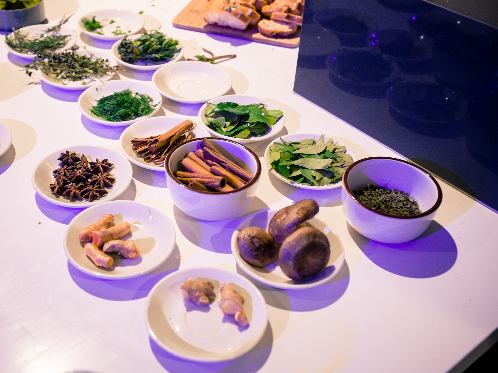
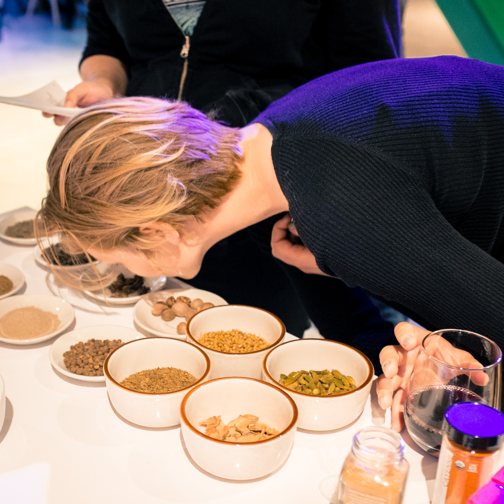

The San Francisco ThoughtWorks office has a lot of foodies and food fans that like to get together for "ThoughtForker" gatherings.
We took a break from our screens this week to learn about the basics in the world of herbs and spices.

Nathan and Badri led us through an arrangement of many ingredients that could impart a special role in a blend we might enjoy in food.

[Ras el hanout](https://en.wikipedia.org/wiki/Ras_el_hanout) was the highlight of the night given that it's one of Badri's favorites. The Arabic translation is "head of the shop," indicating that it is unique wherever it's purchased.
Each shop gets to choose its "top shelf" ingredients to create its blend.

My reaction to the description of the blend was similar to my reaction of learning that "masala" translates to mixture while I was in India for the first time. In both cases, there will be an opportunity of finding a particular blend you really like and never being able to find it again given the availability of ingredients or access to a particular shop.

Badri later led a few of us in creating two different renditions to exemplify how one could suit what we had on hand.

## Smelling and Tasting

My favorite component of the night was smelling (and in some cases tasting) the contrast of spices in the many forms they can take, including fresh, ground, and even country of origin.

One of my favorite spices, cinnamon, varies in three primary varieties aside from coming in whole or powdered form. The ceylon variety even [provides some health benefits](http://www.wsj.com/articles/SB10001424052702303376904579135502891970942) in addition to its
pleasant flavor I enjoy in a bowl of Greek yogurt with peanut butter, bananas, and blueberries.

Nutmeg is another example of a spice that can cause some unexpected side-effects aside from imparting flavor. There are claims that it can cause shared [hallucinogenic effects when it is consumed in large amounts](http://www.compoundchem.com/2014/03/24/the-hallucinogen-in-your-kitchen-the-chemistry-of-nutmeg/). :anguished:

## Tasty noms

The night was not devoid of delicious food. :ok_hand:

Badri and Nathan took the time to provide a delectable spread that consisted of:

* Green quinoa salad with arugula and pistachios
* Chermoula Carrots

* Roasted butternut squash and red onion with tahini dressing
* A white bean spread that could be mixed with our favorite spices and spread on bread. I went with a generous sprinkle of Hungarian paprika. :fire:

Variety is the spice of life, and I'm happy we take the time to switch off our techie gears to appreciate the complexities that lie in the kitchen.

