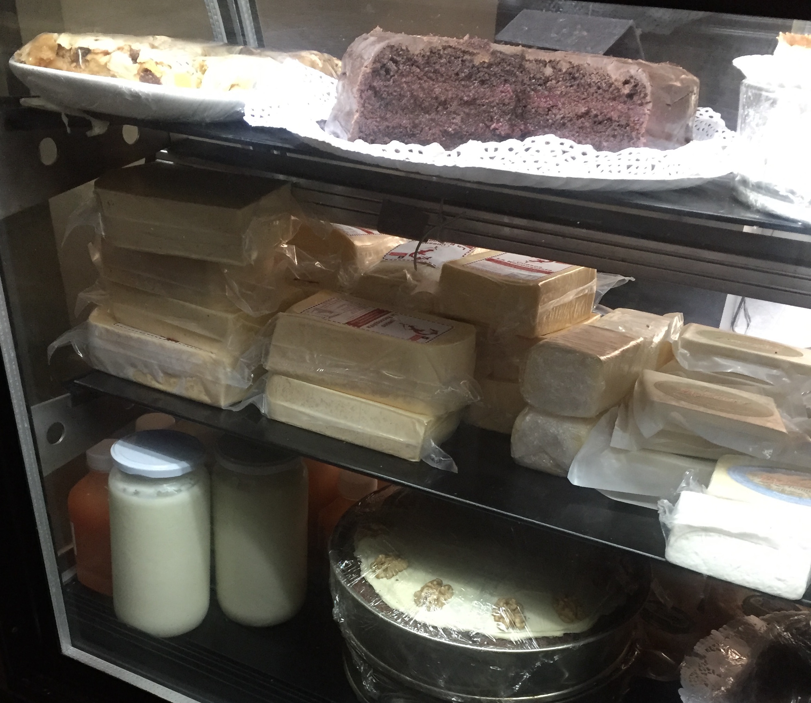

I love dairy. Ice cream, ALL the cheese, eggs, Greek yogurt -- all of it.
Living in Chile has made me realize how accustomed I've gotten to having access to pasteurized milk,
and a variety of options when it comes to picking a source of high protein Greek yogurt or cottage cheese.

Basically, my _gringa_ is showing.

During my first night in Santiago I walked over to the nearest grocery store to stock up on the basics. Eggs, yogurt, produce, meat.
I circled around the store looking for Greek yogurt and came out empty handed, my alternative would have been cottage cheese but I couldn't even find that.
Instead I saw watery yogurts blended with _something else_. The brand [Quillayes](http://quillayes.cl/?cat=91) makes a "Natural Yogur Griego" but sweetens it with stevia. Yes, [stevia is "natural"](https://en.wikipedia.org/wiki/Stevia), but why?

Days went by and I figured I would just buy a gallon of milk and make my own, but my grocery expeditions made me realize gallons of milk are not a thing. Nor are any other refrigerated options.
Side note: eggs aren't refrigerated either and they don't need to be. The reason they're refrigerated in the US is because [the eggs are washed before distribution](http://www.npr.org/sections/thesalt/2014/09/11/336330502/why-the-u-s-chills-its-eggs-and-most-of-the-world-doesnt).

What I did find were abundant options of [UHT or long shelf-life](https://en.wikipedia.org/wiki/Ultra-high-temperature_processing) and powdered milk, but the question of ¿Dónde está la leche? remained.

_Lotsa leche in little boxes_

Turns out, according to a barista I spoke to at [Taste](https://www.facebook.com/Taste_cl-363572603802678/), the distance between Santiago and dairy farms is too far for distributors to guarantee that they can keep milk properly refrigerated.
Too bad for my Greek yogurt addiction. Chilean baristas are also in agreement to dislike boxed milk because it doesn't steam well. It kind of tastes weird too. I've been holding back
from ordering anything other than filter/pour-over.  :coffee:

Over the weekend, I found that [Colmado Cafe](https://www.facebook.com/ColmadoCoffee/) sells natural, house-made, full-fat yogurt when I saw a liter jar of it in their cheese display case. :raised_hands:

_Could it be? Natural yogurt in the wild!_

I knew it would be a gamble, but I asked if it happened to be Greek style. The response I got from the barista made me laugh. :joy:
He was offended by my question and replied with: "No! Es echo aquí en Chile." (No, [it's not made in Greece], it's made in Chile!)

I asked for a taste and it was tasty enough for me to tell them to take my money. My plan was to strain the extra water to give it a thicker consistency once I got home.

Close enough.

The purchase inspired me to make my own Greek yogurt using UHT milk.

I happened to walk by an ad for a product called [Yogustart](http://www.yogustart.com/#!yogustart/gbomc) which is just powdered yogurt cultures and found a natural foods store called
[Emporio Natural Free & Lush](https://www.facebook.com/EmporioNaturalFreeAndLush/) near my office that sells it.

My first experiment gave me a decent result, I heated a liter of non-fat milk in a saucepan and stirred in a sachet of Yogustart to a temperature that felt warm to the touch.
I would have heated it to the instructed 110ºF but I've been having a hard time finding kitchen thermometers here too!
I poured the mixture into a liter jar and put it in an insulated lunch box to rest overnight. The result after straining was about a pint of yogurt.

¯\\_(ツ)\_/¯

I will probably get in the routine of making a couple batches a week. Glad to know it's possible and the ability to control what goes in it is what I care about.
I've already got a second batch of kombucha brewing, Greek yogurt will only be another thing to tinker with in the kitchen. :grin:
