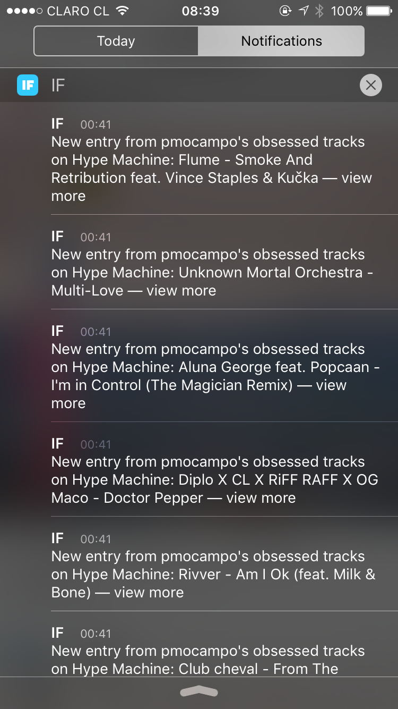

Life in Santiago involves me being stingy with my mobile data and wandering around the city is great with some tunes that I can have offline with my Spotify Premium subscription.
When it comes to finding new songs and artists, The Hype Machine has been my defacto source for [music trends ever since 2008](http://hypem.com/pmocampo)!

The popular feed is gold to me and I usually love whatever is on for the day. The iOS app has limited functionality for what you can save offline.
So, I thought, wouldn't it be nice if I could connect my personal loved tracks feed straight into a Spotify playlist I can save offline?

## <3 IFTTT

If you take a look on almost every page on The Hype Machine, you can find a small section titled *Developer Access*.
The section includes two links to XML and JSON feeds for the specific page you're on. The pages I was interested in were my [Loves/Favorites](http://hypem.com/pmocampo) and [Obsessions](http://hypem.com/pmocampo/obsessed).

Obsessions are tracks that you keep listening to over and over again on the Hype Machine. Sometimes tracks that end up on my list are ones I don't realize I like and haven't favorited yet. :joy:

IFTTT supports hooking up any XML feed to the [Feed Channel](http://ifttt.com/feed) that is valid XML. From each item that the feed returns, you can get information from the title tag and send it over to the Spotify channel to search for a track.
I published an IFTTT recipe that does this and you can make use of it by adding it to your recipe book.

> 

## Caching

One thing I noticed when I was testing the recipe out was that the XML feed wasn't reflecting the tracks I was adding in "real time" but the JSON feed (which IFTTT doesn't support) was. :disappointed:

I reached out to the founder of the Hype Machine on Twitter and apparently the XML feed updates every hour or so.
<blockquote class="twitter-tweet" data-lang="en" data-conversation="none">

<a href="https://twitter.com/pmocampo">@pmocampo</a> ah, the RSS ones are cached more heavily, could be like an hour. Yea, depending on what you like the % avail may disappoint :/
&mdash; Anthony V. (<a href="https://twitter.com/fascinated">@fascinated</a>) <a href="https://twitter.com/fascinated/status/742774754638200832">View Full Conversation</a>
</blockquote>

At first I thought, OK I guess I'm OK with that, but then I found another discrepancy with the XML feed. If I removed a favorite song and added it again (to cause IFTTT to pick up a "new" entry to add to my Spotify playlist) the publish date on the XML entry was what the original favorite had been before.
This caused IFTTT to once again skip over the song since the entry wasn't new.

:weary:

## DIY XML Feed

So given that the JSON feed was the clear winner but IFTTT didn't support it, what did I do?
Wrote a node server to transform the JSON feed into a more "real time" XML feed and deployed it on Heroku.
e.g. http://hype-rss.herokuapp.com/loved.

You can find the code on github: https://github.com/pamo/hype-rss

Once I hooked it up to the recipe, I started seeing push notifications from IFTTT when a new song was added.

 

### There were a few things and decisions I made in writing the server:

1. There are strict rules a feed has to meet in order to be accepted as valid RSS.
    * [W3C's feed validator](https://validator.w3.org/feed/) is a manual way to test. I'm sure there are automated tests available to take care of this as you're developing.
2. Node's HTTP library makes it easy to make a GET request to receive a JSON payload and accumulate chunks of data in a response, but I found it a bit clumsy when I wanted to respond with XML.
    * As a result, I spun up an Express server instead of using Node's built in server to respond with XML.
3. [node-rss](https://github.com/dylang/node-rss) is a great library that will take care of all the hard work for you!
4. IFTTT has a few requirements itself when it comes to RSS feeds:
    * it must have a top-level feed title and a unique link -- this wasn't clear to me so I just linked to the RSS feed's path
    * a GUID and date for each entry -- Hype Machine assigns an ID to each track, so I chose to use that
    * valid RSS or Atom syntax -- This is where the W3C validation came into use

One final caveat: although IFTTT can go search Spotify for a track found on the Hype Machine, it most likely won't find anything. The beauty of the Hype Machine is that the tracks that are trending are brand spanking new (and most of the ones I like are remixes).

<blockquote class="twitter-tweet" data-lang="en">
<a href="https://twitter.com/pmocampo">@pmocampo</a> the favorites should update pretty quickly, but i&#39;d warn you that many of the tracks aren&#39;t on spotify
&mdash; Anthony V. (<a href="https://twitter.com/fascinated">@fascinated</a>) <a href="https://twitter.com/fascinated/status/742772304355164161">View Full Conversation</a></blockquote>

STILL, worth a shot and I had fun tinkering with something to curate my jams. :stuck_out_tongue_winking_eye: :headphones:

