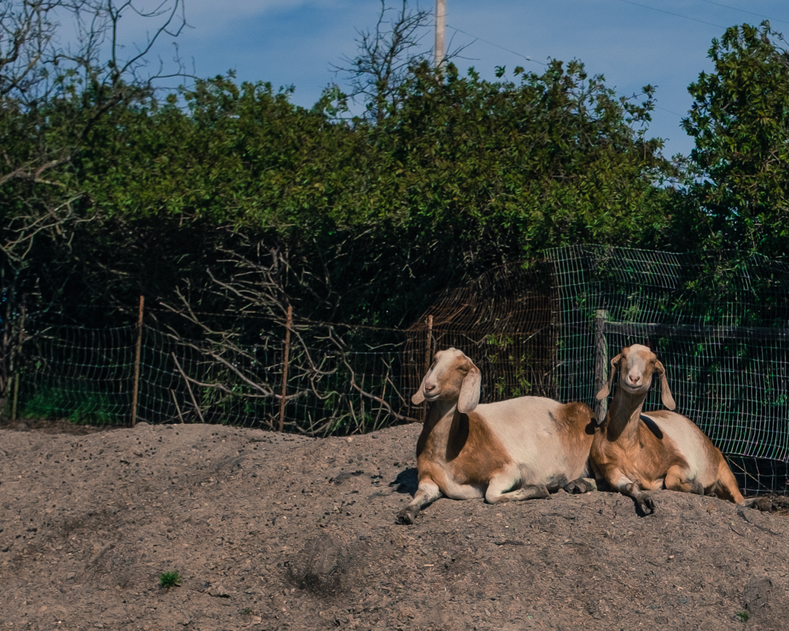

> I believe humans' age-old association with farm animals provide important intangible benefits to humanity. We are better for living alongside them. Those of us who have the pleasure of being around them every day likely benefit the most. We are taught in stark relief the lessons of nature -- the inevitability of illness, injury, and death; the cycles of birth, growth, aging, and decline. We are constantly reminded of the fragility of life, of what it takes to be a good parent, of bravery, patience, loyalty. If we are paying attention, we are learning from them, constantly.

Nicolette Hahn Niman, _Defending Beef: The Case for Sustainable Meat Production_

The last time I visited my grandparents was over 17 years ago. Each visit to Mexico brought about lasting experiences around farm animals. It's been years since they've passed away and I don't know the state of the land they used to own in Guerrero.
