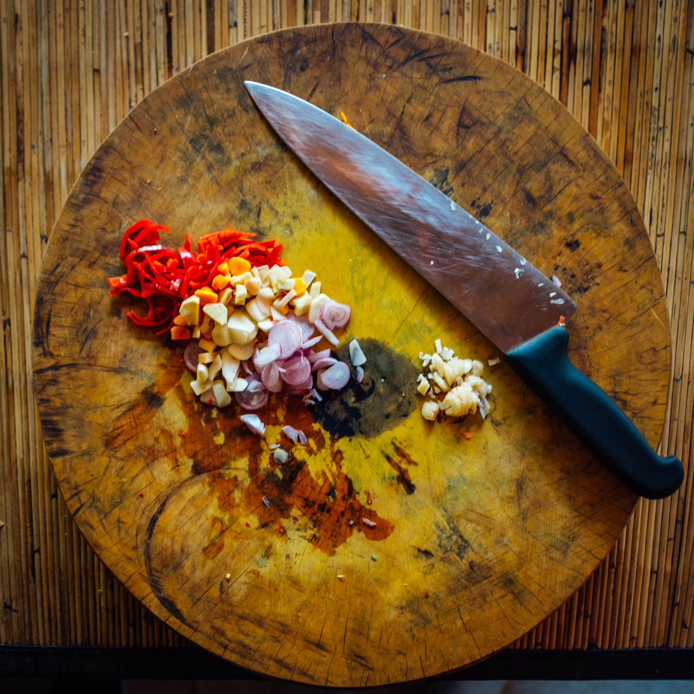
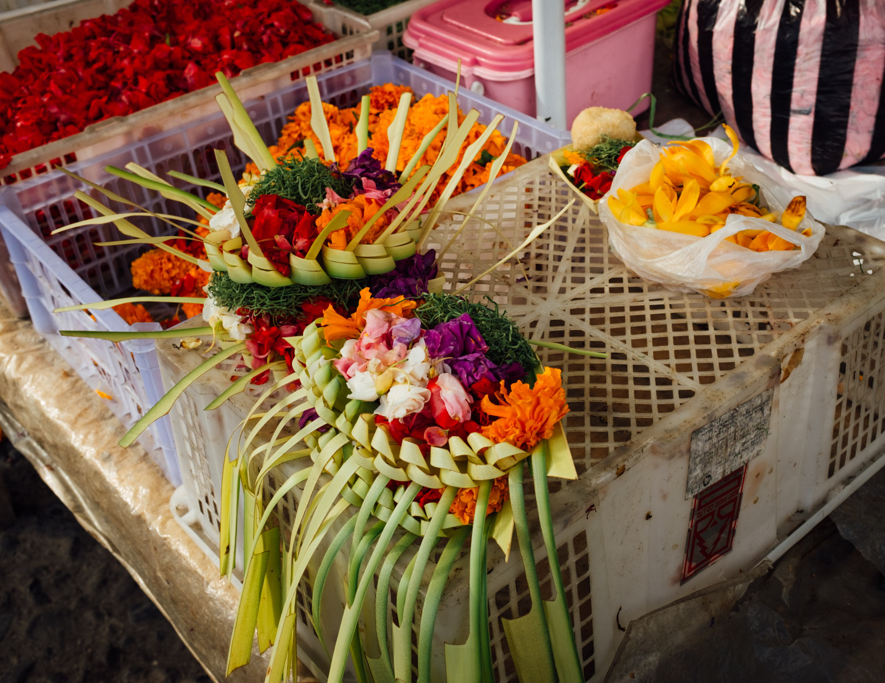

When it comes to traveling, experiencing a new culture through its food is a given. However, during my search for experiences to have in Bali, a cooking class teaching traditional cuisine made its way into my plans. After reading the description [_The Lobong Culinary Experience_](https://lobongbalicooking.com/lobong-culinary-experience/), I was sold.

> Begin your experience at a local market, where your Family Host will purchase and explain the fresh herbs, spices, fruits and vegetables used in your class. Once home, you’ll be greeted by Dewa with a pipping hot cup of coffee or tea, or mineral water and his famous _Pisang Goreng_, fresh made crispy Banana Fritters, to set off your taste buds.

~[Pisang Goreng sweetened with palm sugar syrup.](eat_pisang_goreng.jpg)

## Payangan Morning Market

Just a short drive away from Ubud is the region of Payangan. We went here to experience a true open-air market experience without the tourism that lies inside of Ubud's similar market. Our 9 am arrival was during the market's lull given that it normally starts at 2 am and over by 10 am. As the saying goes, the early bird gets the worm.

~[Nap time: markets open at 2am and are over by 10](market_markets_open_at_2am_and_close_at_10am.jpg)

Our tour of the market was simply educational, meaning we didn't actually buy anything.
We stopped at a few stands with Sang Made, our market guide, and listened as he pointed out ingredients and produce of interest.

### Breaking the Fast

~[Breakfast of Balinese Champions](market_roast_pig_brekkie.jpg)

One of the more memorable moments was at the beginning of our tour when we looked over at a stand with a full _Babi Guling_ (roast suckling pig) laid out ready for consumption. According to our Sang Made, _Babi Guling_ is Bali's breakfast of champions. The group consisting of 9 Dutch, a couple from France, and me was stunned. Fruit bowls and eggs seemed to be what was being served in the hotels and home stays! Sang Made clarified that yes, that is what is served to foreigners — not what is actually consumed in a Balinese home.

Sang Made explained that in their culture, fruits were normally used for enhancing the offerings to their gods. Fruits are fun, and we inspected many that were exotic for most of us.

~[Familiar fruits](market_familiar_fruits.jpg)
~[Pop quiz, what fruit could this be? The answer is jackfruit!](market_who_can_tell_me_what_fruit.jpg)

We inspected the 'snakeskin' fruit in detail. In summary, it's kinda bland and crunchy. I'll stick to dragon fruit next time.

~[Lives up to its snakeskin name](market_snakeskin_fruit.jpg)
~[Peels like a banana](market_peel_it_like_a_banana.jpg)

### Familiarizing Ourselves with Ingredients

The primary purpose of the market tour was too have a first hand look at what ingredients would look like among market stands.
We talked about the salad we would be making and a distinction was made between the greens in traditional western salads and Balinese salads. In Bali, fern tips are used rather than the common romaine, spinach, and kale.

~[Fresh ferns for Jukut Urab.](market_fern.jpg)
~[Aromatic basil and lemongrass found in a variety of Balinese delicacies](market_aromatic_basil_and_lemongrass.jpg)

 [_Bumbu Bali_ or _Base Gede_ is a sauce that flavors many dishes](https://andanyways.com/2014/05/25/how-to-make-bumbu-bali-or-base-gede/). To me it sounds like a _masala_ you would make to flavor an Indian dish. We inspected each of the root vegetables serving a role in "bumbu Bali" (base Balinese sauce) and discussed the
 difficulty of being able to find these in a conventional grocery store back home.

~[Ginger, galangal, and aromatic ginger](market_root_veggies_used_as_foundation_spices.jpg)

### Market Snacks
During our tour of the market, Sang Made pointed out snack food common in most markets.

We watched a sate stand owner carefully turn each stick of meat and waft air on the coconut shell charcoal to disperse heat.
~[The art of sate means knowing when it's well done.](market_art_of_sate.jpg)
~[Sate stand](market_sate_offerings_at_9am.jpg)

As we watched a woman make what looked like a refreshing coconut jelly drink, Sang Made advised us that our stomachs may not be prepared for it, and that we should stay away.
~[Coconut jelly drink](market_coconut_jelly_snack_drink.jpg)
~[A hefty helping of palm sugar syrup](market_healthy_helping_of_palm_sugar.jpg)

## Chop Chop, Bali!

Our hosts repetitively mentioned we would soon get to go back to the family compound to get down to "chop chop!" This phrase stuck with me and we definitely did a lot of worthwhile chopping. After we licked our plates clean of our day's work, we received a booklet with all of the recipes we'd prepared for the day.

The grunt of the work in two of our dishes was preparing the _bumbu_ to flavor the meat. The most involved component of preparation for the day!

The preparation of the meat for the first two recipes was similar with the exception of allowing the first to poach in the sauce and finishing the second on a charcoal grill.

### Prepping the Bumbu

~[Chop, chop!](prep_chop_bumbu.jpg)

~[Loved some knife work and especially loved the tamarind wood chopping block](prep_mince_bumbu.jpg)
~[Take the bumbu to a mortar and pestle and grind until it forms a paste](prep_collecting_students_bumbu.jpg)

### Ayam Bakar Sambal Matah
### Ayam Bakar Bumbu Bali

~[Sear skin-side down for two minutes](prep_searing_ayam_bakar_bumbu_chicken_two_mins.jpg)
~[Simmer](prep_braising_ayam_bakar_bumbu_chicken.jpg)
~[Grilled and ready to serve](prep_cooked_ayam_bakar_bumbu.jpg)

### Jukut Urab
~
~
~[Grated coconut is a magical secret ingredient](prep_grated_coconut_in_all_the_things.jpg)

### Sate Lilit Ayam

~[Sate paste ingredients](prep_sate_paste_ingredients.jpg)
~[Frying ingredients for sate paste](prep_frying_peanuts_for_sate_paste.jpg)
~[Fry until the garlic is browned and add green chilies at the end](prep_fry_until_garlic_browns.jpg)
~[Forming a paste on a mortar and pestle](prep_stone_ground_paste.jpg)
~[Once a paste is formed, add coconut milk to create the sauce](prep_sate_paste_coconut_milk_for_sauce.jpg)
~[Ground chicken ready for seasoning](prep_ground_chicken.jpg)
~[Can't forget the grated coconut](prep_grated_coconut_magical_ingredient.jpg)
~[Mix the chicken dough!](prep_mix_the_chicken_dough.jpg)
~[Coax the meat onto its stick](prep_coax_the_meat_on_the_stick.jpg)
~[Ready to grill](prep_basket_of_sate_lilit_ayam.jpg)
~[Pre-lunch snack](eat_appetizer.jpg)

### Sambal Ulek

This tomato-base sambal served as a sauce to flavor our rice.

~

### Nasi Sela

I didn't photograph the preparation of this dish given that making it took place in a dimly lit kitchen with a stove heated with wood. The process of making Nasi Sela, or steamed rice with sweet potato, takes at least an hour and twenty minutes. This steaming process allows each grain to cook to a point in which it will not stick to any other grain. This dish is the first to be prepared in a Balinese home given the amount of time it takes. While the rice cooks, other dishes can be prepared.

_Makes 2 servings_

**Ingredients**

- 200 gm rice, washed twice
- 100 gm cubed sweet potato/butternut pumpkin

**Method**

1. Clean the rice then soak in water for about 20 minutes
2. Steam the rice until half cooked (al dente), approximately 30 minutes.
3. Soak again in hot water for around 15 minutes or until the rice absorbs all the water.
4. Finally, mix the rice with cubed sweet potato and steam again for 30 minutes.
5. To serve, sprinkle fried shallots for additional flavor.

Easy right?

### Bubur Injin
No photographs of the preparation for dessert because we didn't prepare it, but here's the recipe for black rice pudding/porridge.

_Makes 2 servings_

**Ingredients**

- 200 grm black glutinous rice, washed
- 120 ml palm sugar syrup
- 2 pandan leaves, shredded, or 2 drops pandan or vanilla essence.
- 250 ml coconut milk
- Pinch salt
- Fresh coconut to garnish

**Method**

1. Soak the glutinous rice in water overnight.
2. Drain the rice and place in a saucepan with 1.5 liters of water. Heat the mixture until boiling and continue to cook for 20-25 minutes, or until the rice is tender.
3. Stir the sugar and one of the pandan leaves into the rice and continue to cook for 5-7 minutes. Set aside to cool.
4. Meanwhile, heat the coconut milk, remaining pandan leaf and the salt in a saucepan until the mixture thickens.
5. To serve, remove the pandan leaves from the rice into 2 serving bowls. Pour over the coconut milk and garnish with fresh coconut.

### Lunch is Served

Before we ate, we followed tradition to honor Hindu gods with offerings from the food we prepared that morning. Sang Made's mother did the honors.

~[Offerings from our creations](eat_offerings_from_our_creations.jpg)
~[Entering the family temple](eat_enter_the_temple.jpg)
~[Placing the offerings on the shrine](eat_placing_offerings.jpg)
~[Blessing the offerings](eat_blessing_offerings.jpg)

~[Dessert](eat_bubur_injin_dessert.jpg)
        eat_constructed_ayam_bakar_sambal_matah.jpg
        eat_cooked_sate_chicken.jpg
        eat_final_ayam_bakar_bumbu_bali.jpg
        eat_final_ayam_bakar_sambal_matah.jpg
        eat_jukut_urab.jpg
        eat_overhead_ayam_bakar_sambal_matah.jpg
        eat_presented_ayam_bakar_bumbu.jpg
        eat_salad_and_sambal.jpg
        eat_turmeric_jamu_refreshing_drink.jpg

## Balinese Culture
During the course of the day, I learned about many facets of Balinese customs and rituals. Most of them related to different stepping stones to reach adulthood.
On our arrival to the Lobong family compound, conversation focused on marriage and the custom for families to ceremoniously come to an agreement about the event.

Families stick together and there’s no such thing as ‘flying the nest’. A male’s residence in the compound changes position in the course of his maturity. The close-knit families make it very rare to see homeless in Bali.

Learning more about the annual kite festival in Bali was inspirational to me. The driver that picked me up from my home stay explained that it is a rooted tradition that has many representations that have changed over time. In a few ways, it represents freedom and coming of age or a symbol of maturity. Bali’s youth took to the rice fields during dusk each day during my stay to practice kite flying.

Apparently, having teeth filed as a coming of age opportunity was one that made my hair rise.
Family compounds are forever. You will never see a family compound up for sale.

While we learned a little bit about daily offerings during the tour of Payangan market, we learned that the men in a Balinese family stay in the kitchen. Women have the responsibility of hand-making the offerings (but in some cases the task is translated to purchasing them at the market).

~[Preparing kits for daily offerings](market_methodical_offering_kit.jpg)

~[Offering vendor waiting for the next customer](market_offering_vendor.jpg)

This is partly because offerings symbolize beauty.
There was a brief mention that you will not see men making offerings in Bali, and if you do, that man is referred to a “beautiful man”.

