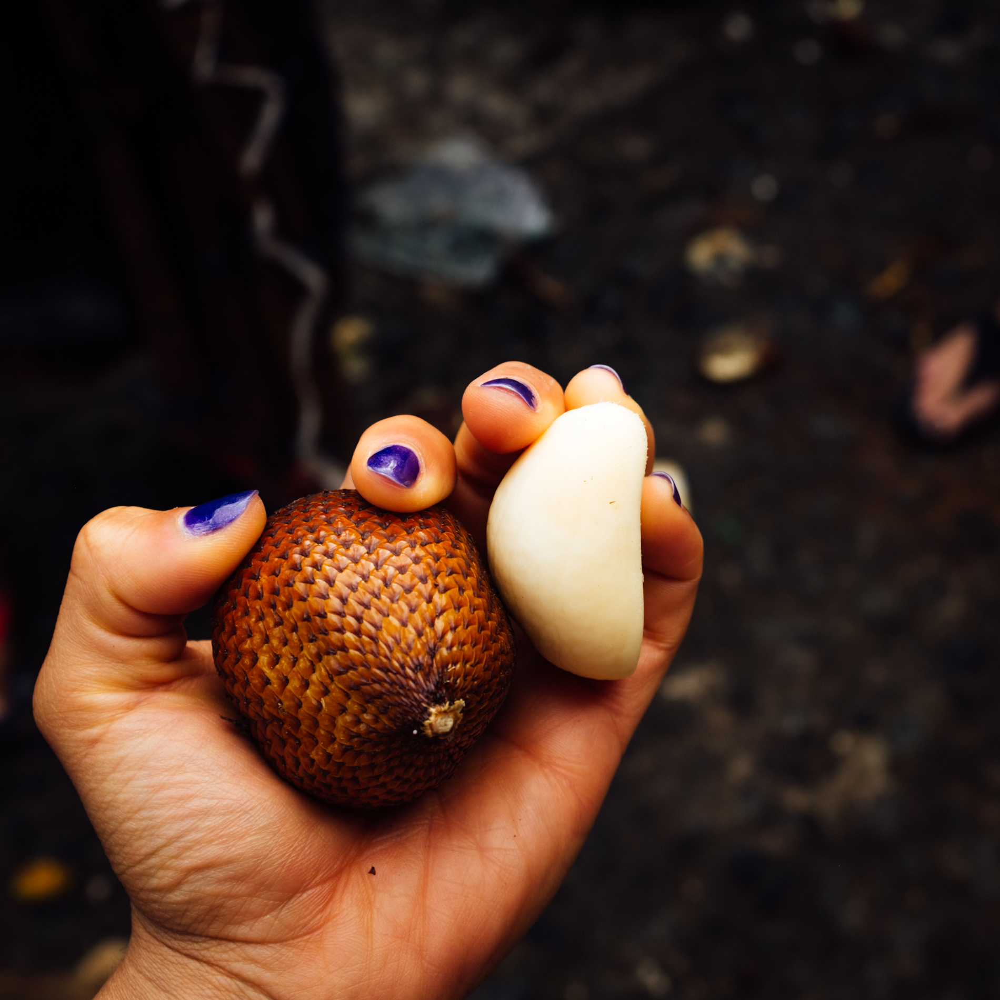
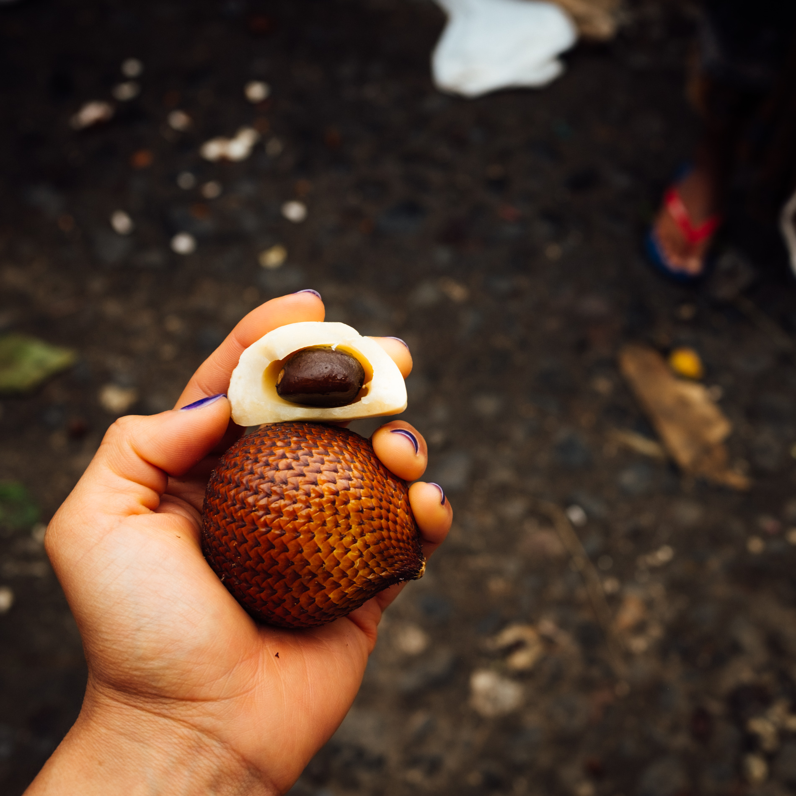
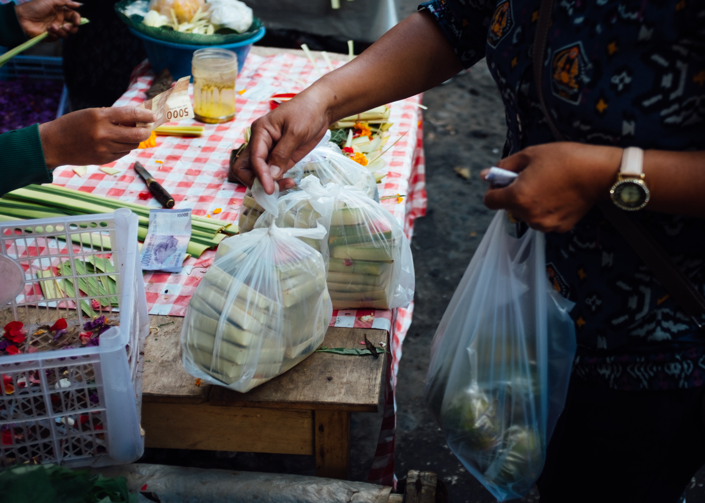

When it comes to traveling, experiencing a new culture through its food is a given. However, during my search for experiences to have in Bali, a cooking class teaching traditional cuisine made its way into my plans. I scheduled a spot with "The Lobong Culinary Experience" and look forward to the tour of an open air market to pick up ingredients for the hands-on experience of cooking traditional dishes.

## Payangan Morning Market

Just a short drive away from Ubud is the region of Payangan. We went here to experience a true open-air market experience without the tourism that lies inside of Ubud's similar market. Our 9am arrival was during the market's lull given that it normally starts at 2 am and over by 10 am. As the saying goes, the early bird gets the worm.

~[Nap time: markets open at 2am and are over by 10](market_markets_open_at_2am_and_close_at_10am.jpg)

Our tour of the market was simply educational, meaning we didn't actually buy anything.
We stopped at a few stands with Sang Made, our market guide, and listened as he pointed out a few ingredients we’d be using in the dishes we would cook later that day.

~[Breakfast of Balinese Champions](market_roast_pig_brekkie.jpg)

One of the more memorable moments was at the beginning of our tour when we looked over at a stand with a full _Babi Guling_ (roast suckling pig) laid out ready for consumption. According to our Sang Made, _Babi Guling_ is Bali's breakfast of champions. The group consisting of 9 Dutch, a couple from France, and me was stunned. Fruit bowls and eggs seemed to be what was being served in the hotels and home stays! Sang Made clarified that yes, that is what is served to foreigners — not what is actually consumed in a Balinese home.

Sang Made explained that in their culture, fruits were normally used for enhancing the offerings to their gods. Fruits are fun, and we inspected many that were exotic for most of us.

~[Familiar fruits](market_familiar_fruits.jpg)
~[Pop quiz, the answer is jackfruit!](market_who_can_tell_me_what_fruit.jpg)

We inspected the 'snakeskin' in detail. In summary, it's kinda bland and crunchy. I'll stick to dragon fruit next time.

~[Lives up to its snakeskin name](market_snakeskin_fruit.jpg)
~[Peels like a banana](market_peel_it_like_a_banana.jpg)

## Balinese Culture
During the course of the day, I learned about many facets of Balinese customs and rituals. Most of them related to different stepping stones to reach adulthood.
On our arrival to the Lobong family compound, conversation focused on marriage and the custom for families to ceremoniously come to an agreement about the event.

Families stick together and there’s no such thing as ‘flying the nest’. A male’s residence in the compound changes position in the course of his maturity. The close-knit families make it very rare to see homeless in Bali.

Learning more about the annual kite festival in Bali was inspirational to me. The driver that picked me up from my home stay explained that it is a rooted tradition that has many representations that have changed over time. In a few ways, it represents freedom and coming of age or a symbol of maturity. Bali’s youth took to the rice fields during dusk each day during my stay to practice kite flying.

Apparently, having teeth filed as a coming of age opportunity was one that made my hair rise.
Family compounds are forever. You will never see a family compound up for sale.

While we learned a little bit about daily offerings during the tour of Payangan market, we learned that the men in a Balinese family stay in the kitchen. Women have the responsibility of hand-making the offerings (but in some cases the task is translated to purchasing them at the market).

~[Preparing kits for daily offerings](market_methodical_offering_kit.jpg)

This is partly because offerings symbolize beauty. There was a brief mention that you will not see men making offerings in Bali, and if you do, that man is referred to a “beautiful man”.

