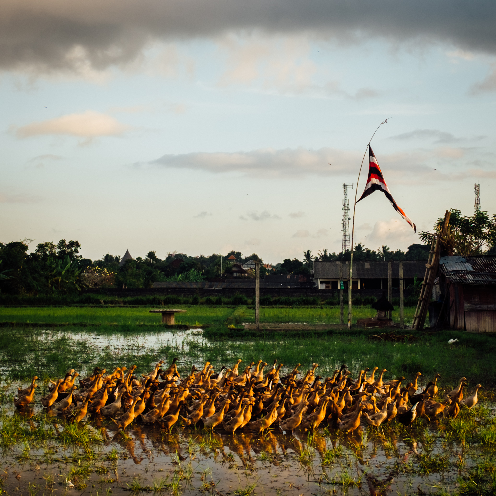

With a quick glance at the recipes in my post about [cooking in Bali](/bali-cooking/), one might think my culinary adventures in Bali were predominately chicken-based. However, outside of the wedding and cooking class, my most enjoyable meals were vegetarian (and at sometimes vegan). The ubiquity of raw, vegan, or vegetarian restaurant menus in Bali took me by surprise.

The ubiquity is normal to me in San Francisco given my circle of friends forms a Venn diagram in the variety of dietary choices. My excuse to try quirky new places or dishes in San Francisco form once I have another interested friend to bring along. For example, I keep a mental note of which friends to call when my favorite Feastly pop-up chefs, [Om Sabor](https://eatfeastly.com/omsabor/), host a Mexican-inspired vegan dinner.

I really missed these friends with every day spent being solo and _veganish_ in Bali and I am excited to be able to act as a guide if I ever make it back with a larger squad.

## Kismet Cafe

[**Kismet Cafe on Foursquare**](http://4sq.com/1Moio0B)

Kismet Cafe was a major stand-out in Ubud. My first visit had me craving their Asian bowl again the next day. By my third visit, they recognized me as a regular, and, for me, it was a great departing meal before flying back home. The restaurant has two floors with open-air seating and it was never too busy. I spent most of my visits devouring their bowls, drinking kombucha or kefir, and sometimes reading or editing photos.

What I really liked about their bowls was the ability to get them with a variety of skewers. I had the option to get 3 or 5 and I always got 5. The first visit was a mix of tofu, seitan, grilled vegetables, mushrooms, and tempeh. After this first visit I discovered which of those options were my favorites. My second and third visit leaned towards choosing 2 tempeh skewers, 1 seitan, and 2 mushroom.

My belly was happy with the volume of the bowls after every visit. These were 'bowls' in the sense that you could choose between red steamed rice or rice noodles to add to the base of leafy greens. I chose noodles on my first visit and decided I didn't care for them (they were crunchy and thin like [Maggi noodles](http://www.tasty-indian-recipes.com/snacks-recipes/maggi-vegetable-atta-noodles-recipe/)). I gave the rice a try the second time and enjoyed its nutty taste. Tempeh was the ingredient in all of my visits that took me by surprise. I'm quick to try anything that's fermented so I was surprised it took me this long to have it. I enjoyed the chewy, nutty, and hearty texture. At one point I decided tempeh would be something I should try making myself once I got home, but after a [quick search](http://www.thekitchn.com/how-to-make-tempeh-cooking-lessons-from-the-kitchn-202369), the process seems to be less forgiving than sourdough, kimchi, or kombucha. I'll save tempeh production for the pros. :sweat_smile:

**Round one**

~[Asian bowl with mixed skewers, clearly superior since it has kimchi](kismet_round_one_asian_bowl.jpg)
~[Local Kefir with a funky coozie](kismet_round_one_kefir.jpg)

**Round two**

~[Gave the classic bowl a try](kismet_round_two_classic_bowl.jpg)
~[Deconstructed skewers](kismet_round_two_classic_deconstructed_skewers.jpg)
~[House-made ginger and star-anise kombucha](kismet_round_two_ginger_star_anise_kombucha.jpg)

**Round three**

~[After asking for extra avocado, I realized it meant getting avocado on the side.](kismet_round_three_asian_bowl_extra_avo.jpg)

## Moksa

[Moksa Restaurant on Foursquare](http://4sq.com/1RTguFN)

Moksa was a special trip in many ways. My first attempt to reach the restaurant from my home-stay on foot was a failure that lead me to a dead-end in a few rice fields, but a cute reward was getting to watch ducks run around one of the fields like lemmings following the flock's collective direction.

The route I ended up taking was dangerous because I was walking on a road with a small shoulder with heavy evening traffic. I decided there was no way I would walk back in the darkness and would find a way to call a taxi to pick me up.

Anxiety around how I would accomplish getting back to my home-stay began to set in when I realized that the back-road leading up to the restaurant is tiny and not meant for anything with more than 2 wheels. Driving on this road means running the risk of falling into a rice field. Even motorbikes and pedestrians would to proceed with careful footing in the darkness. When I _did_ have a taxi pick me up, we had to carefully reverse and teeter on the edge of the path to turn around after realizing there was only one way out. At one point, we met a group of people walking towards the restaurant that had to turn around and walk back in order to give us the right of way.

Was the risk of falling into a rice field in a taxi van worth it? **Yes**.

I got to the restaurant just as the sun began to set and took a seat at a table near the edge of the open candle-lit gazebo dining area so that I could get a glimpse of [permaculture](https://en.wikipedia.org/wiki/Permaculture) garden Moksa maintains to provide ingredients for the menu.

Sometimes when I'm out having a meal by myself I will listen to podcasts and, as serendipity would have it, the topic was about the phenomenon of [waiting in line for food](http://freakonomics.com/podcast/what-are-you-waiting-for/). Lucky for me, solo-dining meant no wait and no reservation required.

I didn't take long to decide on what I would have after I realized the three-course prix fixe menu was only $15 USD! Each item on the menu made a clear distinction whether it was raw or heated. I chose a variety of both.

~
The meal started with an amuse-bouche that consisted of a slice of cucumber with some sort of hummus. Unfortunately I wasn't paying attention when the waitress came by and missed what she said. :see_no_evil:

**Appetizer**

~[Mega Life Salad ( Raw )](moksa_salad_appetizer.jpg)
"Seared tofu, gotta cola, baby spinach, grated carrots, red beet, cucumber, spring mix, avocado, and toasted nuts With orange lemongrass dressing"

I loved that the toasted nuts turned out to be spiced cashews. The tender greens reminded me of eating baby spinach and butter lettuce from my tiny garden plot for the first time. :heartpulse:

There were flakes in the salad that I didn't quite recognize but looked and tasted like Parmesan. I felt that they went well with the cashews to add a pleasant crunch.

**Main Dish**

~[Jerky Mignon ( Heated )](moksa_main_dish.jpg)

"Grilled young jackfruit fillet, on a bed of vegan mushroom and mustard cream sauce, served with cumin-braised cabbages and sweet potato fries."

I chose this after consulting the waiter taking my order and was not disappointed. During the meal, I took some short notes about what I thought as I chewed each of the components on the plate.

I kept sopping up the mustard cream sauce with the braised cabbages to tame the spice from the caramelized cabbage and onions. It was my first time eating jackfruit "meat" and it felt squishy, thick, and meaty. The "mignon" was more like a couple of slider patties. The "thickness" of each bite needed some water to wash it down, however, the final texture was softer and smoother than what I expected. Sear marks are always a nice satisfying touch and I appreciated their placebo effect of making food "taste better".

I saved the purple sweet potatoes fries for last. Their deep purple hue made me think that they had a beetroot taste. Their crunchy skin in addition to sesame seed crust was amazing and they had a cajun kick to them that took me by surprise. The one downside was that they were saltier than the rest of the plate, but this was not a problem once dessert came along.

**Dessert**

Labeled as "nice cream" on the menu, which meant frozen desserts with a coconut, cashew, or pumpkin seed base. I couldn't decide on what to have, I was craving a coconut base but found the other options intriguing. So I asked the waiter to categorize the flavors by base for me:

* Vanilla ( cashew )
* Chocolate coffee ( cashew ) - my first pick
  - Absolutely creamy and nutty
  - Primarily chocolate flavor than coffee
  - Thicker base than the scoop of jackfruit cardamom, but melted much faster
* Strawberry ( coconut )
* Fermented black rice
* Jack Cardamom ( coconut & pumpkin ) - my second pick
  - 'Meaty' texture with seeds
  - Cardamom forward and sweeter than chocolate coffee
  - Aftertaste had hint of bananas
* Durian ( coconut )

~[Scoops of jackfruit cardamom and chocolate coffee](moksa_dessert.jpg)

## Suka Espresso

[Suka Espresso on Foursquare](http://4sq.com/2kqzPlk)

This was by far the most hipster cafe I visited during the entire trip. I was surrounded by Australians, one of which sent a flat white back because it was "not a flat white" :sweat_smile:, and each meal began with a perfectly posed overhead shot of the meal.

So, when in Rome, gotta take food porn photos like the rest.

~[Mushroom toast with beetroot hummus for lunch](suka_espresso_toast_poached_egg_mushroom.jpg)
~[Poached egg yolk porn](suka_espresso_yolk_porn.jpg)
~[Cappuccino on the side](suka_cappuccino.jpg)

## Padang Food Stall

[RM. Simpang Tiga on Foursquare](http://4sq.com/kWVqRz)

My first night at Oman's Guest House ended in my host walking me through rice fields in the darkness to reach the food stalls nearby at a night market. We stopped at a [Padang food stall](https://en.wikipedia.org/wiki/Padang_cuisine#Padang_restaurants) where we had the option to choose from a variety of dishes. We sat down with our plates and ate on picnic style tables covered with vinyl tablecloths. This was the most 'home style' meal I had during my stay in Bali and it was a comforting meal to have with another person, even though our conversation was primarily broken English.

~[Rice, chicken, eggplant, braised cabbage, tempeh.](padang_cuisine.jpg)

## Bali Budda

[Bali Buda on Foursquare](http://4sq.com/bzotNO)

I had high hopes for Bali Buda given their small market next door that was reminiscent of a tiny Whole Foods. However, the salad I ordered was not as satiating as the ones I had at [Kismet](#kismet-cafe) and they were out of avocado. I decided to pair the salad with a Beat The Heat juice (beets, celery, cucumber, parsley).

~[Bali Bunda Bowl with sunflower seeds, poached egg, and chicken](bali_budda_bali_bunda_bowl_and_juice.jpg)

## Ice Cream

Ice cream deserves its own section because happiness is unlimited tastings to decide among exotic flavors.

[**Tukies**](http://4sq.com/2opAZCN)

All coconut menu made it easy to decide.

~[Coconut with roasted coconut crumble](tukies_coconut_icecream.jpg)

[**Gelato Secrets**](http://4sq.com/X4EWdo)

Vibrant and funky sorbet flavors made me do a double take. Got the black charcoal and passionfruit cinnamon as my last snack in Ubud.

~[Dragonfruit cinnamon with black charcoal](gelato_secrets_dragonfruit_black_charcoal_cinnamon.jpg)

[**Gaya Gelato**](http://4sq.com/dzbNdN)

Dessert with my home stay host after eating from a Padang food stall.

~[Coffee and cashew gelato](gaya_gelato_coffee_and_cashew.jpg)

## Coffee

Specialty coffee in Ubud is easy to come by if you're willing to go out of your way to find it. The baristas at [Seniman Coffee](http://sprudge.com/seniman-coffee-bali-65480.html), [Gangga Coffee](https://www.facebook.com/ganggacoffee/), [7Cups](https://www.facebook.com/7CupsUbud/) know their way around a pour-over brewer and espresso machine.

The [nitro cold brew](https://www.instagram.com/p/BYFqi-BAJkf) at Seniman is especially exquisite.

## Go Back with Me!

I'm happy to know that Bali is a destination for any dietary choice or restriction. If I ever get the opportunity to travel to Bali, I definitely see myself in a longer stay in Ubud potentially working remotely. Hopefully I'll have a few other people with me next time to share the experiences I had while I was there.
